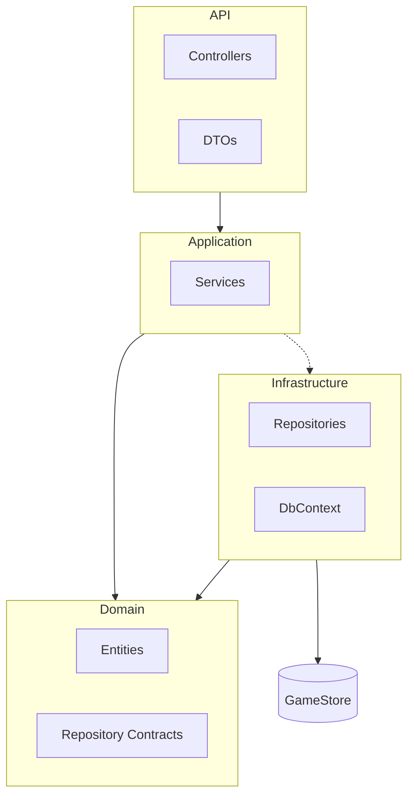
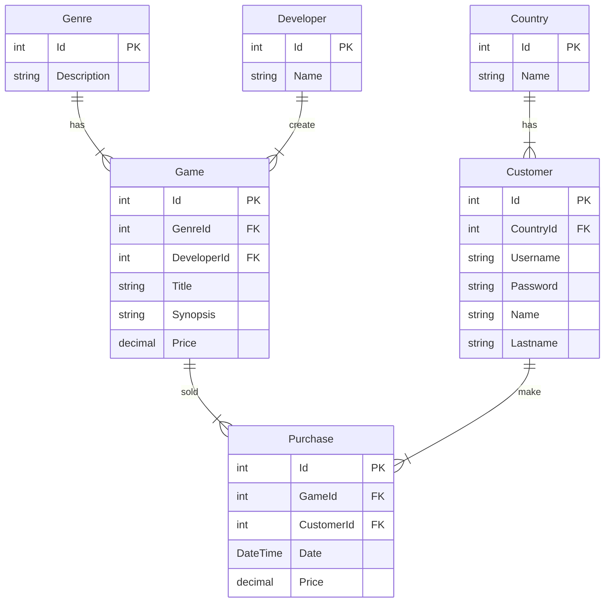

# GameStoreBackend

## **Acerca de la solución**

Este es un diagrama de las capas de la solución:

Los 4 proyectos del servicio web son:

- API: Recibe las peticiones del cliente HTTP.
- Application: Contiene los servicios de la aplicación, los casos de uso.
- Domain: Aloja las clases del dominio.
- Infrastructure: Accede a los servicios externos y a la base de datos.

Al desarrollar la solución tuve en cuenta los siguientes conceptos:

- Clean Architecture
- Hexagonal Architecture
- Principios SOLID
  - Single responsibility principle
  - Open/closed principle
  - Liskov substitution principle
  - Interface segregation principle
  - Dependency inversion principle
- DRY (Don't Repeat Yourself)
- YAGNI (You Aren't Gonna Need It)

También utilicé las siguientes metodologías:

- Trunk-based Development
- C# Coding conventions (https://docs.microsoft.com/en-us/dotnet/csharp/fundamentals/coding-style/coding-conventions)
- Conventional commits (https://www.conventionalcommits.org/en/v1.0.0/)
- Semantic versioning para los tags (https://semver.org/)

## **Herramientas**

Las herramientas de desarrollo que usé fueron:

- Visual Studio 2022
- Source Tree
- Postman

Frameworks y librerías utilizados:

- .NET 6
- Swagger
- Serilog
- Newtonsoft.Json
- AutoMapper
- Entity Framework Core
- xUnit
- Moq

## **Proceso de análisis y desarrollo**

Las historias de usuario que desarrollé, adicionalmente a los CRUD de las entidades, son:

- Como cliente quiero comprar un juego.

### **Diagrama de entidad relación**

